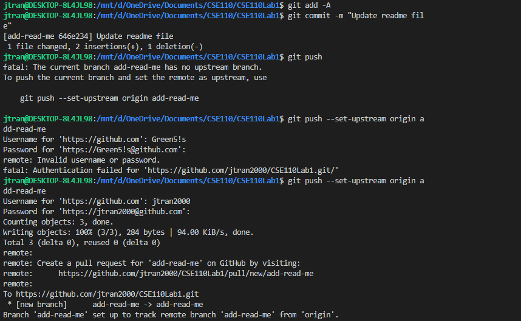
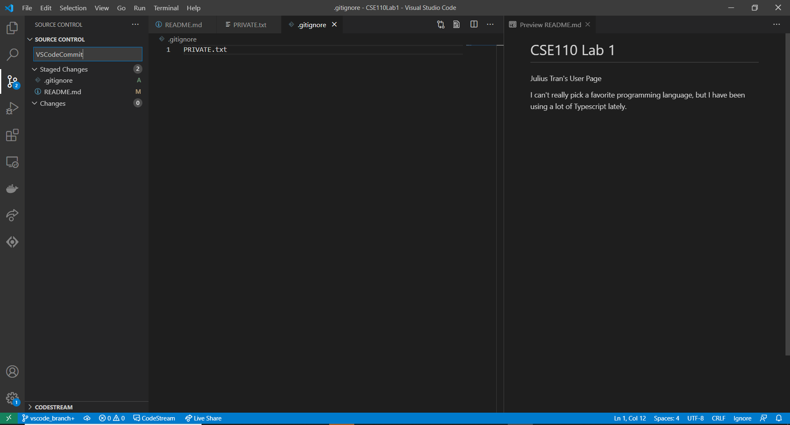

# Julius Tran's User Page

**This is for CSE 110, Lab 1**

[Here is the README](README.md)

- [Julius Tran's User Page](#julius-trans-user-page)
  - [My CSE 110 To-Do List](#my-cse-110-to-do-list)
  - [Screenshots](#screenshots)
  - [Quotes](#quotes)
  - [About Me](#about-me)

## My CSE 110 To-Do List

- [X] Slack sign-up
- [X] Individual and Team Survey
- [X] Individual Engineer Statement
- [X] Lab Week 1
- [ ] Review Quiz Week 1
- [ ] Professor Greeting
- [ ] Meme or Other Item in #Random

## Screenshots

## Quotes

>This is a quote.

`print("Hello World)`

## About Me

I am a 3rd-year Mathematics - Computer Science Major at UCSD, from Eleanor Roosevelt College.

Here are the Programming Languages I have used, in order of most to least familiarity

1. Javascript/Typescript
2. Java
3. C++

Stuff I do in my free time:

- Coding personal projects
- Watching TV and movies
- Reading
- Playing video games

[Here is my LinkedIn](https://www.linkedin.com/in/juliustran/)

